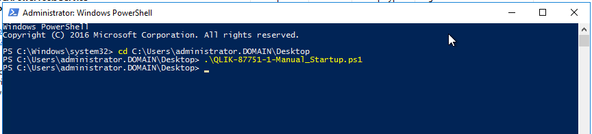
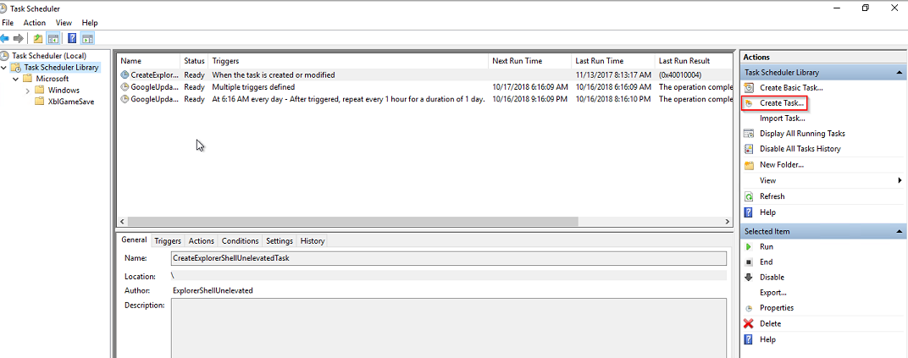
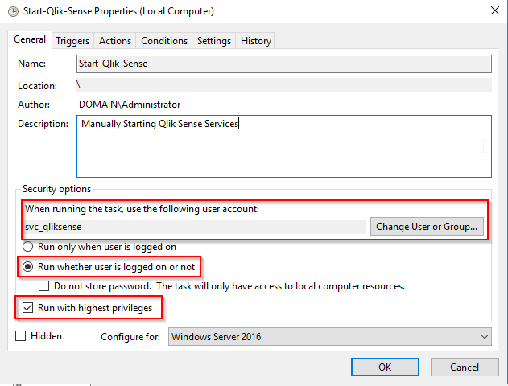
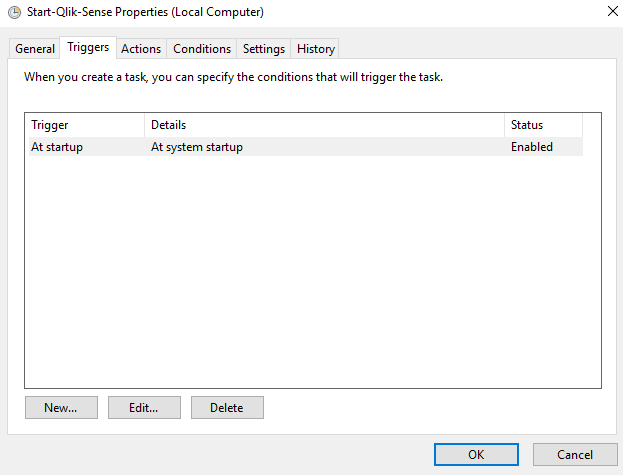
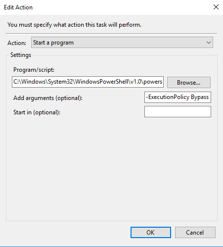
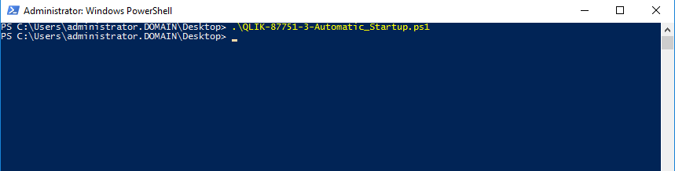

# Work-around for QLIK-87751
Contents:
- `Scripts/QLIK-87751-1-Manual_Startup.ps1`: PowerShell Script to change the startup type for all Qlik Sense Services to manual.
- `Scripts/QLIK-87751-2-Reboot.ps1`: PowerShell script which will manually handle the start of Qlik Sense services on a multi-node environment.
- `Scripts/QLIK-87751-3-Automatic_Startup.ps1`: PowerShell Script to change the startup type for all Qlik Sense Services to automatic, delayed start.

**Assumptions**:
 - Qlik Sense is run by a domain level account with local administrator rights.
 - The scripts are built for 4 servers. If fewer or more than 4 servers are used, then adjust the repeated call blocks in all scripts.
 
**Config**:
- `Scripts/QLIK-87751-1-Manual_Startup.ps1`: Define servernames on lines 5-8.
- `Scripts/QLIK-87751-2-Reboot.ps1`: Define servernames on lines 5-8. See below for instructions on configuring the Windows Scheduled Task
- `Scripts/QLIK-87751-3-Automatic_Startup.ps1`: Define servernames on lines 5-8.

**Execution**:

`Scripts/QLIK-87751-1-Manual_Startup.ps1`: Place script in a directory, launch PowerShell as the service account as an admin. Execute the script.

`Scripts/QLIK-87751-2-Reboot.ps1`:
- Start > Task Scheduler
- Highlight Task Scheduler Library

- Select *Create Task*
- On the General Tab:
  - Provide a Name (arbitrary)
  - Provide a description (arbitrary)
  - Change User to the Qlik Sense Service account (mandatory)
  - Select run with highest privileges

- On the Triggers Tab:
  - New Trigger > Select At Startup

- On the Actions Tab:
  - New Action > Start a Program
  - Program/Script: `C:\Windows\System32\WindowsPowerShell\v1.0\powershell.exe`
  - Add arguments: `-ExecutionPolicy Bypass C:\Temp\QLIK-87751-2-Reboot.ps1` (Note: Adjust C:\Temp\ to path where the script lives)

`Scripts/QLIK-87751-3-Automatic_Startup.ps1`: Place script in a directory, launch PowerShell as the service account as an admin. Execute the script.

